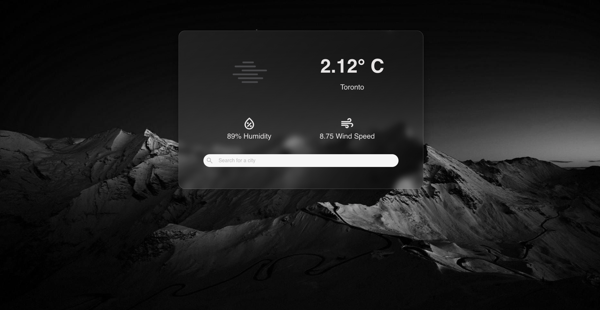

# Weather

## Overview

'Weather' is a Vue desktop application designed to provide users with precise and trustworthy weather information, including temperature, humidity, and wind speed using the OpenWeather API.

## Features

- **Temperature Tracking**: Get current temperature readings to plan your day accordingly.
- **Humidity Information**: Understand the moisture level in the air for your comfort and health.
- **Wind Speed Details**: Know the wind conditions, especially useful for outdoor sports and activities.
- **User-Friendly Interface**: Easy to navigate interface.
- **Search Functionality**: Look up weather information for different locations.
